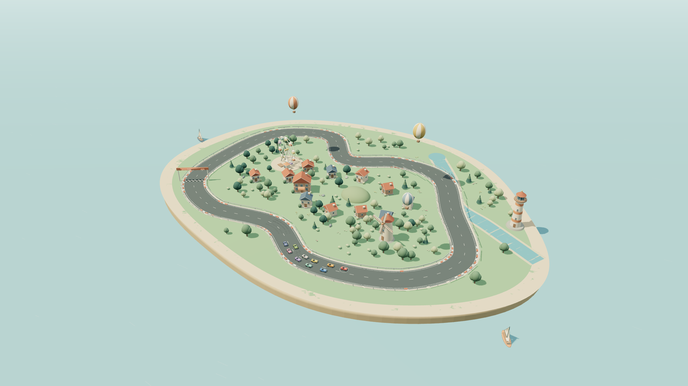

# Tiny Laps

A little world, always in motion. Ten autonomous racers compete through city streets and around miniature island circuits, with close-up cameras, aggressive driving personalities, collision damage, destructible scenery and terrain, and a developer control room.

**[Watch the race](https://chasehendrick.github.io/TinyLaps/)**



Open `index.html` directly in a modern browser. It is a portable offline build with no asset downloads, accounts, API keys, or external service calls.

## Explore

- Choose among **18 worlds: 15 circuits and 3 dense cities** with miniature route previews. The chooser freezes the race while open, then restores your previous pause state.
- **Foundry City, Old Quarter and Garden Metro** send the ten racers through downtown and neighborhood streets, with rounded junction turns and local traffic. Foundry is the starting world for new visitors.
- **Pebble Bay, Clover Hills and Sundown Valley** retain the original coastal, hill and evening worlds.
- **Meadow Oval, Orchard Square, Crescent Cove, Fern Switchbacks, Lantern Point, Lucky Clover, Seabreeze Sprint, Highland Ribbon, Lagoon Keyhole, Amber Chicane, Summit Loop and Dusk Run** add twelve different centerlines, including long straights, linked bends, narrow loops and elevated sections.
- Drag to orbit, scroll or pinch to zoom, and use the zoom buttons for close views.
- Select a car in the world or standings. **Follow** trails it, **Ride** faces along its actual heading, and **Tour** slowly circles the island.
- Racers keep competing. Each has a distinct autonomous driving policy: attackers, late brakers, defenders, opportunists and hotheads. The temperament selector changes their appetite for risk.
- The condition meter, contact count and driving intent show what is happening. Impacts visibly crumple panels, mark paint, bend glass and alter wheel alignment. Heavy front damage produces engine smoke.
- Restart restores cars, terrain, scenery, barriers and tire marks while preserving your camera, speed and pause state. On phones, standings and driver details start compact and can be expanded.

## God powers and developer tools

Open the wrench in the lower right or press **D**.

| Power | Effect |
| --- | --- |
| Drop a meteor | A falling body strikes the world, deforms ground, damages scenery and pushes nearby cars. |
| Shockwave | Applies radial impulses to cars and breaks nearby objects and barriers. |
| Raise / lower terrain | Sculpt the real terrain mesh and roadway. The changed height, slope, roughness and grip affect driving. |
| Repair ground | Restores the terrain in a brush radius. |
| Grab & throw | Choose cars, adult townspeople, buildings, trees, rocks, or landmarks. Hold to lift, release gently to drop, or flick to throw. Hard landings and collisions cause damage. |
| Boost / spin racer | Apply a forward or off-center impulse to the selected body. |
| Repair racer | Restore its body, engine and suspension condition. |
| Restore whole world | Rebuild the scenery, terrain, barriers and all racers. |

The **Physics** tab exposes gravity, tire grip, impact restitution, damage intensity, engine power and simulation speed. Freeze time to inspect a moment. The **Inspect** tab shows body outlines, obstacle colliders, velocity vectors, steering, throttle, braking, slip and damage.

Buildings crumple into rubble, trees fall, and broken props become nonsolid. Debris uses gravity, bounce, angular motion and ground friction. Roads deform with the terrain, and segmented guardrails retain damage until the world is restored.

The villages have 36 residents, including families. Adults and children walk around their homes, run from meteors, shockwaves, terrain powers, and thrown objects, then return to their routines. Adult bodies have articulated shoulders, elbows, hips, and knees, with stylized tumbles, injury, small temporary blood flecks, and recovery. Blood effects apply only to adults and are capped at 48 tiny particles. Children remain uninjured background town life. Repair ground also restores nearby adult health.

## Controls

| Key | Action |
| --- | --- |
| `1` / `2` / `3` / `4` | Explore / Follow / Ride / Tour camera |
| `←` / `→` | Select previous / next racer |
| `+` / `−` | Zoom |
| `Space` | Pause / resume |
| `H` | Hide / show the main controls |
| `G` | Pick up, drop, or throw cars, adults, and scenery |
| `D` | Developer tools and god powers |
| `Alt` + `M` | Open the circuit chooser |
| `Escape` | Close god tools and return to exploration |

Your current circuit and race save automatically in this browser every 2.5 seconds and when you leave. Saves retain lap progress, car damage, sculpted terrain, scenery damage and moved buildings, residents and their recovery, barriers, city traffic, water flow, camera, and control settings. Reopening restores that race without advancing it while the page was closed. An older city save keeps its world changes and car damage when a route revision moves racers onto the new streets; lap timing restarts for the revised course. Restart deliberately clears race and world damage. If browser storage is unavailable, the game reports that the race is limited to the current session.

Optional ambient audio starts only after you enable it. The camera button saves a postcard of the current view. Fullscreen uses the browser's fullscreen feature.

## How it works

The scene is procedurally modeled with Three.js. The camera adjusts its near plane for wide views, and decorative surface layers use explicit depth offsets to keep beaches, paint and water stable as the camera moves. These rendering offsets do not change the physical terrain height. Vehicles use a fixed 120 Hz simulation with finite mass and yaw inertia, front and rear tire slip, friction limits shared between steering and braking, longitudinal weight transfer, engine force, drag, braking and surface friction. Autonomous drivers steer, choose passing lines, defend positions, plan braking and recover from mistakes.

Car contacts use oriented rectangles, contact impulses, angular response, friction and penetration correction. Throws and shockwaves can launch cars into ballistic flight, with gravity, air drag, height-aware contacts and landing damage. Tire forces stop while a car is airborne. Scenery uses approximate circular colliders. Grabbed buildings and props move under gravity, collide with scenery and cars, and collapse into bounded debris after hard impacts. Pedestrians use a walkable path graph with simple body trajectories and joint poses. Impact severity accumulates directional body damage and reduces engine power, tire stiffness and grip. World damage shares the vehicle simulation's surface and obstacle data.

This is a stylized physics model for a miniature world. It is not calibrated to a particular real vehicle, and the procedural panel deformation is not a finite element or soft-body crash simulation. Terrain is a bounded height field, so it supports craters and hills rather than caves or arbitrary topology. Decorative hills are scenery; river maps use a depth-averaged 1D channel flow model with gravity, discharge, hydrostatic pressure, terrain-driven dam response, and visible advection. Boats and wooden debris respond to buoyancy and current; stone sinks. Ocean currents and waves are approximations, not a full 3D fluid solver. Buildings and trees have simplified colliders. Debris has its own gravity and ground contact model.

## Develop

```sh
npm ci
npm test
npm run build
npm start
```

Open `http://127.0.0.1:8765`. The local server command requires Python 3. Rebuild and reload after changing source files. The checked-in `index.html` contains all JavaScript, styles and the Three.js license, so it can also be shared as a single file.

| File | Role |
| --- | --- |
| `app.js` | Scene, cameras, UI and system integration |
| `race.js` | Vehicle dynamics, contacts, driving AI and lap timing |
| `cars.js` | Rounded roadsters, directional damage and smoke |
| `scenery.js` | Village, vegetation, animation, destructible props and debris |
| `terrain.js` | Mutable height field, road deformation and surface sampling |
| `devtools.js` | God tools, physics controls and live inspection |
| `pedestrians.js` | Instanced residents, family routines, reactions, and stylized ragdolls |
| `grab.js` | Pointer motion converted to a bounded throw velocity |
| `persistence.js` | Validated browser saves and restoration |
| `tracks.js` | Shared circuit definitions |
| `track.js` | Rounded street routes and island circuit sampling |
| `build.mjs` | Portable offline build |

Tests run 180-second autonomous races on all 18 worlds and cover vehicle dynamics and collision damage, model deformation and exact repair, terrain and roadway displacement, destructible scenery, family reactions, adult throws and recovery, movable building damage, and save restoration. GitHub Actions runs the tests and verifies that the committed offline build matches the source.

## Reference

Inspired by the miniature-world racing concept in [Christopher J. DiMarco's video](https://x.com/chrisjdimarco/status/2104598205417591120). The scene, vehicle meshes and implementation here are original procedural work. No media or source code from that demonstration is included.

Third-party licensing is recorded in [THIRD_PARTY_NOTICES.md](THIRD_PARTY_NOTICES.md).

## City districts

Foundry City, Old Quarter, and Garden Metro add 84 to 114 buildings, 25 to 30 connected intersections, 24 to 28 local vehicles, parks, crossings, signals, and 108 residents per world. These are original fictional districts rather than maps of real places. Local traffic follows the road graph, makes continuous junction turns, obeys phased signals, and can reroute when a queue remains blocked. Junction reservations and vehicle footprints keep local cars from overlapping. Local cars yield at the curb to approaching racers; real contacts transfer momentum and damage. Its cars share the grab and throw controls.
